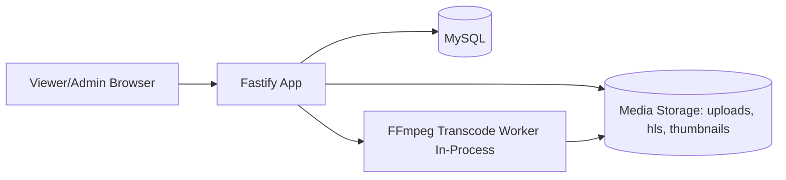
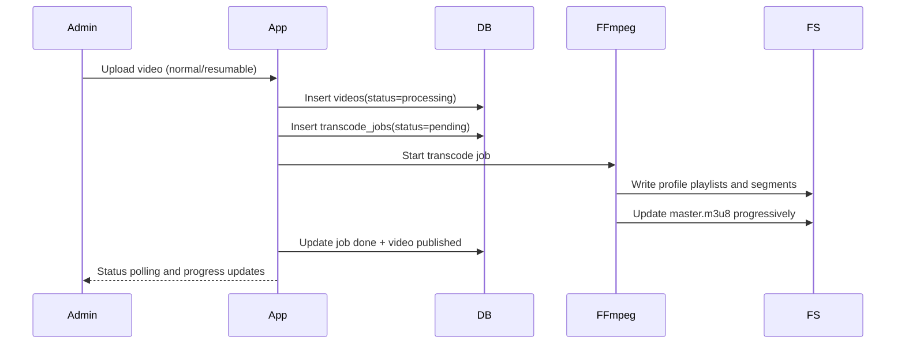
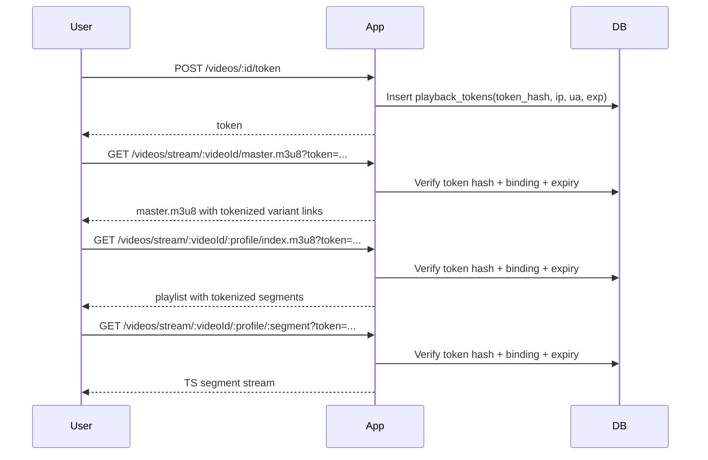
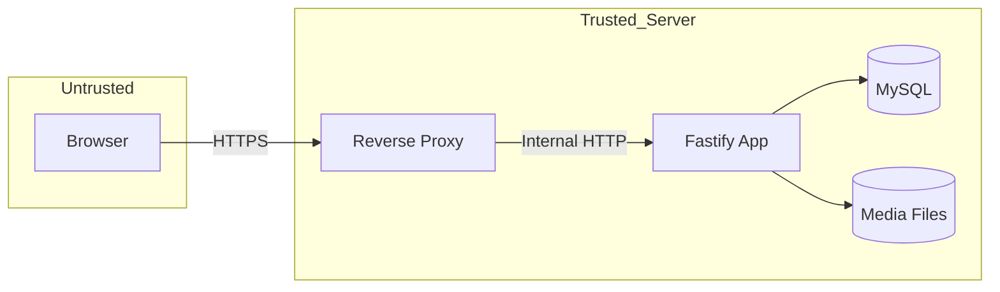
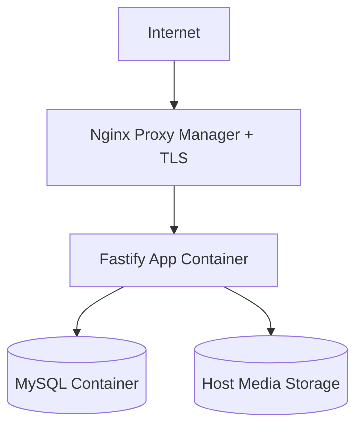

# Video Stream Portal Architecture

## 1. Purpose And Scope

This document defines the architecture of the internal video streaming platform, including:

- runtime topology
- Fastify application structure
- data model boundaries
- upload and transcode pipeline
- playback access control
- security trust boundaries
- deployment and scaling considerations

The scope reflects the current implementation in this repository.

## 2. High-Level System Context

The platform is a server-rendered web application where authenticated users watch HLS videos and admins manage uploads, users, and course assignments.



Primary interaction modes:

- Viewer: login, browse, watch, complete video progress
- Admin: upload/transcode, publish management, user management, monitoring

## 3. Runtime Architecture (Docker)

Current runtime services:

- `app` (Node.js/Fastify)
- `db` (MySQL 8.4)

Optional/edge runtime:

- Nginx Proxy Manager or nginx reverse proxy for internet exposure

Media is persisted on bind mount:

- `./media` -> `/app/media`

Database is persisted on named volume:

- `db_data` -> `/var/lib/mysql`

Ubuntu VAAPI mode (hardware transcode) adds device passthrough for `/dev/dri/card1` and `/dev/dri/renderD128`.

```mermaid
flowchart TB
    subgraph Host[Ubuntu Host]
        MED[(./media)]
        VOL[(db_data volume)]
        DRI[/dev/dri/*]
    end

    subgraph Compose[Docker Compose]
        APP[video-portal-app]
        DB[video-portal-db]
    end

    U[Browser] --> APP
    APP --> DB
    APP <-->|bind mount| MED
    DB <-->|volume| VOL
    APP <-->|VAAPI passthrough| DRI
```

## 4. Application Architecture (Fastify)

Entry point:

- `src/server.js`

Plugins:

- `src/plugins/db.js`: MySQL pool lifecycle
- `src/plugins/auth.js`: JWT cookie auth, session hydration, role guards
- `src/plugins/csrf.js`: double-submit CSRF cookie + request validation

Route modules:

- `src/routes/pageRoutes.js`: page navigation and profile pages
- `src/routes/authRoutes.js`: signup/login/logout/password flows
- `src/routes/videoRoutes.js`: browse/watch/token/stream endpoints
- `src/routes/adminRoutes.js`: user admin, upload, queue, retry, courses, monitoring

Service modules:

- `src/services/authService.js`: auth/session/audit helpers
- `src/services/videoService.js`: FFmpeg orchestration and HLS generation
- `src/services/settingsService.js`: runtime settings storage

View layer:

- EJS templates in `src/views`

Static assets:

- `/public/*` from `src/public`

## 5. Data Architecture (MySQL)

Core domain tables:

- `users`, `sessions`, `settings`
- `videos`, `video_files`, `video_progress`
- `playback_tokens`, `transcode_jobs`
- `courses`, `course_videos`
- `audit_logs`

Table groups and responsibilities:

- Identity/access: users, sessions
- Media lifecycle: videos, video_files, transcode_jobs
- Playback control: playback_tokens
- Learning UX: video_progress (tracks `last_position_seconds`, `duration_seconds`, `last_watched_at`, `completed_at` per user per video), courses, course_videos
- Governance/traceability: audit_logs, settings

Migration files:

- `migrations/001_init.sql`
- `migrations/002_phase2_security.sql`
- `migrations/003_video_metadata_and_progress.sql`
- `migrations/004_courses_tags_jobs.sql`
- `migrations/005_watch_progress_fields.sql`

## 6. Upload And Transcode Pipeline

Upload modes:

- normal multipart upload
- resumable chunked upload

Pipeline summary:

1. Admin uploads source video
2. Video row is created as `processing`
3. Transcode job is queued in `transcode_jobs`
4. FFmpeg creates profile variants (`480p`, `720p`, optional `1080p`)
5. Master playlist is updated progressively
6. Video status transitions to `published` on success
7. On failure: job status becomes `failed`, video may become `failed`



## 7. Playback And Access Control Flow

Playback access model:

1. Authenticated user requests watch page
2. Client requests short-lived playback token
3. Server stores token hash with user, video, IP, user-agent, expiry
4. HLS endpoints verify token integrity, expiry, and DB binding
5. Server rewrites m3u8 and segment URLs with token query



Token grace period:

- `PLAYBACK_TOKEN_GRACE_SECONDS` (default 30) is applied on both JWT expiry check and DB binding lookup, preventing intermittent 403 errors on segment requests near token expiry.

Progress save flow:

- Client POSTs `{ positionSeconds, durationSeconds }` to `/videos/:id/progress` every `PROGRESS_SAVE_INTERVAL_SECONDS` (default 15 s), on pause, and on tab hide.
- On watch page load the server reads `video_progress.last_position_seconds` and passes it to the client as `initialProgressSeconds`; the player seeks to that position on first play.
- A video is marked complete when `positionSeconds / durationSeconds >= PROGRESS_COMPLETE_RATIO` (default 0.95) or when the explicit completion flag is sent.

## 8. Security Architecture And Trust Boundaries

### Current controls

- HTTP-only auth cookie with JWT payload
- server-side session table and rolling session expiry
- role-based access guards (`requireAuth`, `requireAdmin`, API auth)
- CSRF double-submit token check for state-changing requests
- login lockout controls and session trimming
- playback token binding to IP and user-agent
- audit logging for sensitive actions

### Trust boundaries

- Browser boundary: untrusted client input
- App boundary: route validation and authz checks
- DB boundary: parameterized SQL usage
- Media boundary: file system read/write and path handling
- Proxy boundary: TLS termination and forwarded headers



### Security notes before internet exposure

- ensure production secrets are rotated
- enforce secure cookies and HTTPS-only external access
- expose only reverse proxy, not direct DB/app host ports publicly
- keep HLS access constrained through token-validated routes

## 9. Configuration Model

Primary runtime configuration is environment-driven:

- app/runtime: `NODE_ENV`, `PORT`, `APP_URL`
- auth/security: `JWT_SECRET`, `JWT_EXPIRES_IN`, `COOKIE_SECURE`
- database: `DB_HOST`, `DB_PORT`, `DB_USER`, `DB_PASSWORD`, `DB_NAME`
- upload/stream: `UPLOAD_DIR`, `HLS_DIR`
- auth policy: `MAX_ACTIVE_SESSIONS`, login lock controls
- transcode: `FFMPEG_BIN`, `FFMPEG_HWACCEL`, `FFMPEG_VAAPI_DEVICE`, `ENABLE_1080P`, `FFMPEG_TIMEOUT_MS`
- VAAPI quality: `FFMPEG_VAAPI_QP` (CQP mode)
- playback token: `PLAYBACK_TOKEN_GRACE_SECONDS` (grace window on expiry checks, default 30 s)
- progress: `PROGRESS_SAVE_INTERVAL_SECONDS` (autosave cadence, default 15 s), `PROGRESS_COMPLETE_RATIO` (completion threshold, default 0.95)

## 10. Observability And Operations

Operational visibility sources:

- Fastify logger output
- admin monitor tab (users, videos, stream events, resource stats)
- `transcode_jobs` and `audit_logs` tables
- health endpoints and docker health checks

Operational actions supported:

- retry failed transcodes
- clear failed upload jobs from admin panel
- force logout / disable / reset user password

## 11. Failure Modes And Recovery

Common failure categories and recovery actions:

- upload interruption: resumable mode and status polling
- FFmpeg/transcode failure: retry job and inspect container logs
- database init/migration failure: fix SQL and recreate volume in test env
- VAAPI incompatibility: adjust encoder options or use software fallback
- stale UI queue state: client queue reset and server failed-job clear action

## 12. Deployment Topology

Internal testing topology:

- direct app access on internal network

Internet-facing topology target:

- Nginx Proxy Manager (TLS, reverse proxy)
- app and db isolated behind private network
- firewall opening only required ingress (`80/443` and restricted SSH)



### Dokploy / NUC media storage

- Deploy the same Docker Compose stack; use the named Docker volume `media_data` (mounted at `/app/media`) so uploads and HLS survive redeploys on Dokploy.
- For very large libraries on a NUC, you may instead bind-mount a host path such as `/opt/video-stream/media:/app/media`.
- For a ~100 GB source library with multi-rendition HLS (`ENABLE_1080P=true`), plan **250–500 GB** total SSD (HLS adds ~1.5–3× source size; reserve 20–30 GB for OS/Docker/MySQL).
- Admin monitoring reports uploads, HLS, thumbnails, and server disk % (warns above 80%).

## 13. Scaling And Concurrency Strategy

For near-term scale (for example 30 concurrent viewers):

- pre-transcoded HLS variants reduce CPU on playback path
- main runtime pressure shifts to network throughput and disk I/O
- load test validated: k6 script at `load-tests/k6-streaming.js` simulates 30–50 concurrent users through full auth → token → HLS segment fetch loop; p95 latency and error rate confirmed stable on NUC hardware
- monitor p95 segment latency and error rate

Expected bottlenecks:

- outbound bandwidth
- storage throughput for segment reads
- DB load from token/session checks under high churn

## 14. Architecture Risks And Hardening Priorities

Top priorities before public release:

1. rotate all placeholder/default secrets
2. enforce secure cookie and HTTPS posture in production
3. lock down exposed ports and use proxy-only ingress
4. verify migration compatibility against pinned MySQL version
5. complete backup/restore validation (concurrency load test completed ✅)

## 15. Decision Summary

Current architecture decisions:

- SSR Fastify + EJS for low operational complexity
- MySQL for durable auth/media metadata and audit logs
- in-process FFmpeg orchestration for direct control and simpler deployment
- token-gated HLS routes with IP/UA binding for basic anti-sharing controls
- Docker-first runtime with optional VAAPI acceleration on compatible hosts

---

Last updated: 2026-04-22
